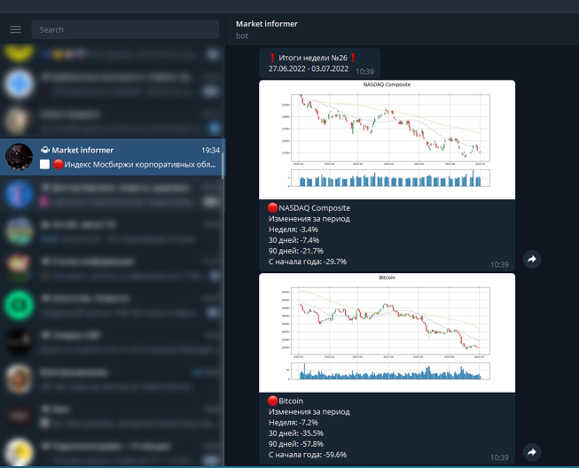

# Telegram бот с функцией парсера финансовой информации с регулярным обновлением
 

Это автоматизированный скрипт, который собирает информацию по выбранным финансовым инструментам с сайтов mfd.ru и Yahoo Finance, преобразует ее в графики и рассылает через Telegram.

Регулярный автозапуск скрипта можно сделать средствами ОС. На Windows 10 это Планировщик заданий, который запускает bat-файл по выбранному расписанию (код заточен под еженедельную рассылку).
